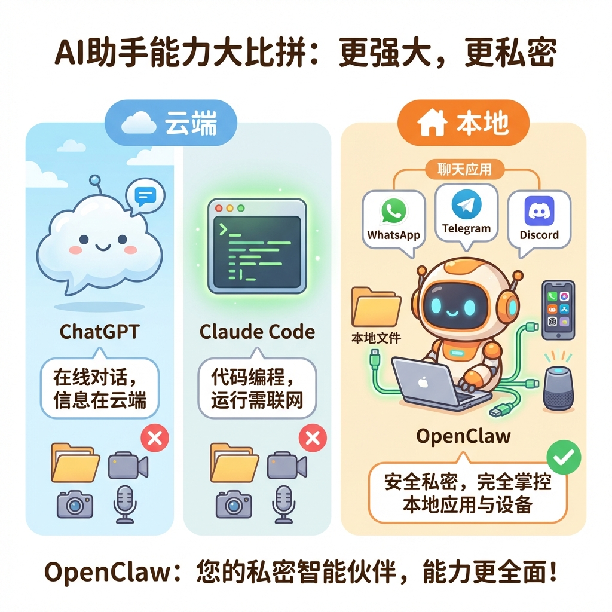

# Awesome OpenClaw 🤖

[](https://github.com/sindresorhus/awesome)

> 精选的 OpenClaw 教程、技能和使用案例集合。

[English](README-en.md) | [简体中文](#)

---

## 0. 一分钟了解 OpenClaw

### OpenClaw vs ChatGPT vs Claude Code



| 特性 | ChatGPT | Claude Code | OpenClaw |
|------|---------|-------------|----------|
| **运行位置** | 云端 | 本地 | 本地 |
| **数据隐私** | ❌ 存在别人服务器 | ✅ 本地 | ✅ 本地 |
| **聊天应用集成** | ❌ | ❌ | ✅ WhatsApp/Telegram/Discord/iMessage |
| **访问本地文件** | ❌ | ✅ | ✅ |
| **自定义技能** | ❌ GPTs (有限) | ❌ | ✅ 无限扩展 |
| **24小时待命** | ❌ 需要打开网页 | ❌ 需要打开终端 | ✅ 后台运行 |
| **多智能体** | ❌ | ❌ | ✅ 可配置多个角色 |
| **主要用途** | 通用聊天 | 编程助手 | 个人AI助理 |

---

## 1. 如何安装

### 安装方式对比

| 方式 | 难度 | 费用 | 适用场景 |
|------|------|------|----------|
| 官方安装 | ⭐⭐ | 免费 | 有技术基础，想要完整控制 |
| EasyClaw | ⭐ | 免费 | 新手友好，一键安装 |
| 腾讯云管家 | ⭐ | 付费 | 企业用户，需要托管服务 |
| 阿里云无影 | ⭐⭐ | 付费 | 云端运行，多设备访问 |

### 1.1 本地安装

#### 官方安装（推荐）

```bash
# macOS / Linux
curl -fsSL https://openclaw.ai/install.sh | bash

# Windows (PowerShell)
iwr -useb https://openclaw.ai/install.ps1 | iex

# 或通过 npm
npm install -g openclaw@latest
```

安装后运行配置向导：

```bash
openclaw onboard --install-daemon
openclaw channels login  # 配置聊天通道
openclaw gateway --port 18789  # 启动
```

#### 第三方安装（更友好）

**EasyClaw** - 一键安装，零配置，无需 API Key

👉 https://sanwan.ai/easyclaw.html

- 适合新手
- 自动配置
- 本地运行，数据安全

**腾讯云管家** - 托管服务

👉 https://claw.guanjia.qq.com

- 企业级支持
- 7×24 托管
- 更多高级功能

### 1.2 云上安装

**阿里云无影**

👉 https://help.aliyun.com/zh/wuying-workspace/use-cases/quickly-build-a-openclaw-through-a-cloud-computer-clawdbot

- 云端运行
- 多设备访问
- 按需付费

**腾讯云**

👉 https://www.tencentcloud.com/act/pro/intl-openclaw

- 国际版支持
- 企业级部署

---

## 2. Awesome Skills

OpenClaw 拥有 5400+ 社区技能，以下是一些热门技能。

> 完整技能列表：https://github.com/VoltAgent/awesome-openclaw-skills

### 🤖 AI & 编程

| 技能 | 描述 |
|------|------|
| [coding-agent](https://github.com/openclaw/skills/tree/main/skills/coding-agent) | 将编程任务委托给 Codex、Claude Code 或 Pi 智能体 |
| [github](https://github.com/openclaw/skills/tree/main/skills/github) | GitHub 操作：PRs、Issues、CI、代码搜索 |
| [gemini](https://github.com/openclaw/skills/tree/main/skills/gemini) | 使用 Gemini CLI 进行编程辅助 |
| [claude-code](https://github.com/openclaw/skills/tree/main/skills/claude-code-skill) | MCP 集成，让 Claude Code 更强大 |

### 🌐 浏览器自动化

| 技能 | 描述 |
|------|------|
| [browser-vision](https://github.com/openclaw/skills/tree/main/skills/browser-vision) | 无头 Chrome 截图、网页自动化、视觉调试 |
| [web-scraper](https://github.com/openclaw/skills/tree/main/skills/web-scraper) | 反爬网页访问，微信公众号/Twitter/Reddit 等 |
| [agent-browser](https://github.com/openclaw/skills/tree/main/skills/agent-browser) | 为 AI 智能体优化的无头浏览器自动化 CLI |

### 🔍 搜索研究

| 技能 | 描述 |
|------|------|
| [deep-research](https://github.com/openclaw/skills/tree/main/skills/deep-research) | 多引擎搜索 + 网页提取 + 结构化分析报告 |
| [web-search](https://github.com/openclaw/skills/tree/main/skills/web-search) | Brave 搜索 + DuckDuckGo 多引擎搜索 |
| [academic-research](https://github.com/openclaw/skills/tree/main/skills/academic-research) | 使用 OpenAlex API 搜索学术论文 |

### 📝 效率工具

| 技能 | 描述 |
|------|------|
| [notion](https://github.com/openclaw/skills/tree/main/skills/notion) | Notion 集成 |
| [obsidian](https://github.com/openclaw/skills/tree/main/skills/obsidian) | Obsidian 笔记 |
| [trello](https://github.com/openclaw/skills/tree/main/skills/trello) | Trello 看板管理 |
| [apple-notes](https://github.com/openclaw/skills/tree/main/skills/apple-notes) | Apple Notes 集成 |
| [apple-reminders](https://github.com/openclaw/skills/tree/main/skills/apple-reminders) | Apple 提醒事项集成 |

### 💬 消息通道

| 技能 | 描述 |
|------|------|
| [discord](https://github.com/openclaw/skills/tree/main/skills/discord) | Discord 机器人集成 |
| [slack](https://github.com/openclaw/skills/tree/main/skills/slack) | Slack 机器人集成 |
| [imsg](https://github.com/openclaw/skills/tree/main/skills/imsg) | iMessage 集成 |
| [bluebubbles](https://github.com/openclaw/skills/tree/main/skills/bluebubbles) | BlueBubbles iMessage 服务器 |

### 🎨 图像视频生成

| 技能 | 描述 |
|------|------|
| [image-gen](https://github.com/openclaw/skills/tree/main/skills/image-gen) | Nano Banana Pro (Gemini 3) 文生图、图生图 |
| [video-gen](https://github.com/openclaw/skills/tree/main/skills/video-gen) | Sora/Kling/Seedance/Veo 3 等视频生成 |
| [openai-image-gen](https://github.com/openclaw/skills/tree/main/skills/openai-image-gen) | DALL-E 图像生成 |

### 🏠 智能家居

| 技能 | 描述 |
|------|------|
| [sonoscli](https://github.com/openclaw/skills/tree/main/skills/sonoscli) | Sonos 音箱控制 |
| [openhue](https://github.com/openclaw/skills/tree/main/skills/openhue) | Philips Hue 控制 |
| [spotify-player](https://github.com/openclaw/skills/tree/main/skills/spotify-player) | Spotify 播放控制 |

### ⚡ DevOps

| 技能 | 描述 |
|------|------|
| [n8n-automation](https://github.com/openclaw/skills/tree/main/skills/n8n-automation) | 设计 n8n 工作流 JSON |
| [security-audit](https://github.com/openclaw/skills/tree/main/skills/security-audit) | Skill 安全扫描 + 系统安全加固 |

### 安装技能

```bash
# 从 ClawHub 安装
clawhub install <skill-slug>

# 或直接把技能链接发给你的 OpenClaw
# 它会自动安装
```

---

## 3. Skill Packs

预设技能包，一键配置特定场景的 AI 助理。

> 来源：https://sanwan.ai/skills.html

### 🦸 超级助理

适合：个人日常助理

**核心技能：**
- 🌐 网页搜索
- 📧 邮件管理
- 📅 飞书日历
- 📄 飞书文档
- 🌤️ 天气查询

**配置提示词：**
```
你是一个高效的个人助理。每天早上检查我的日程和邮件，
提醒重要事项。当我问问题时，先搜索网络获取最新信息。
使用飞书记录重要信息，用飞书日历管理我的日程。
```

---

### ✍️ 内容创作者

适合：公众号、小红书、Twitter 运营

**核心技能：**
- 🖼️ AI 图片生成
- 🧑 AI 文本人性化
- 💚 微信公众号
- 🐦 Twitter / X
- 📕 小红书运营
- 📄 PDF 生成

**配置提示词：**
```
你是一个专业的内容创作者。帮我：
1. 生成吸引人的图片
2. 把文案改写成不同平台风格（小红书活泼、公众号正式）
3. 使用人性化工具去除 AI 味
4. 发布前生成 PDF 预览让我确认
```

---

### 📈 股票分析师

适合：A股/港股/美股投资

**核心技能：**
- 📈 股票监控
- 📊 股票深度分析
- 🇭🇰 港股 AI 投研

**配置提示词：**
```
你是一个谨慎的股票分析师。帮我：
1. 监控我关注的股票，重要指标变化时提醒
2. 提供多维度分析（基本面、技术面、资金面）
3. 给出客观分析，不提供具体买卖建议
4. 用飞书记录每日市场观察
```

---

### 🌊 出海运营官

适合：海外市场运营

**核心技能：**
- 🌐 网页搜索
- 💼 LinkedIn 运营
- 🐦 Twitter / X
- 🔬 深度研究
- 🕵️ 竞品研究

**配置提示词：**
```
你是一个海外市场运营专家。帮我：
1. 用英文在各平台发布内容
2. 监控竞品动态
3. 分析目标市场趋势
4. 维护 LinkedIn 专业形象
5. 运营 Twitter 账号获取海外用户
```

---

### 🛒 电商运营

适合：淘宝/京东/拼多多运营

**核心技能：**
- 🖼️ AI 图片生成
- ✍️ SEO 内容写作
- 📕 小红书运营
- 🔬 深度研究

**配置提示词：**
```
你是一个电商运营专家。帮我：
1. 生成商品主图和详情图
2. 写 SEO 优化的商品标题和描述
3. 在小红书种草推广
4. 分析竞品定价和策略
```

---

## 4. Awesome Use Cases

真实的使用案例，展示 OpenClaw 能做什么。

> 完整用例：https://github.com/hesamsheikh/awesome-openclaw-usecases

### 📰 内容消费

| 用例 | 描述 |
|------|------|
| [Daily Reddit Digest](https://github.com/hesamsheikh/awesome-openclaw-usecases/blob/main/usecases/daily-reddit-digest.md) | 自动总结你关注的 subreddit |
| [Daily YouTube Digest](https://github.com/hesamsheikh/awesome-openclaw-usecases/blob/main/usecases/daily-youtube-digest.md) | 每日总结你喜欢频道的视频 |
| [Multi-Source Tech News](https://github.com/hesamsheikh/awesome-openclaw-usecases/blob/main/usecases/multi-source-tech-news-digest.md) | 从 109+ 来源聚合科技新闻 |

### 🎬 内容创作

| 用例 | 描述 |
|------|------|
| [YouTube Content Pipeline](https://github.com/hesamsheikh/awesome-openclaw-usecases/blob/main/usecases/youtube-content-pipeline.md) | 自动化视频选题、研究、追踪 |
| [Multi-Agent Content Factory](https://github.com/hesamsheikh/awesome-openclaw-usecases/blob/main/usecases/content-factory.md) | 多智能体协作生产内容 |
| [Podcast Production](https://github.com/hesamsheikh/awesome-openclaw-usecases/blob/main/usecases/podcast-production-pipeline.md) | 播客全流程自动化 |

### 💼 效率提升

| 用例 | 描述 |
|------|------|
| [Personal CRM](https://github.com/hesamsheikh/awesome-openclaw-usecases/blob/main/usecases/personal-crm.md) | 自动发现和追踪联系人 |
| [Second Brain](https://github.com/hesamsheikh/awesome-openclaw-usecases/blob/main/usecases/second-brain.md) | 发消息给机器人记录，可搜索的知识库 |
| [Custom Morning Brief](https://github.com/hesamsheikh/awesome-openclaw-usecases/blob/main/usecases/custom-morning-brief.md) | 定制每日早报 |
| [Inbox De-clutter](https://github.com/hesamsheikh/awesome-openclaw-usecases/blob/main/usecases/inbox-declutter.md) | 自动总结订阅邮件 |

### 🏠 自动化

| 用例 | 描述 |
|------|------|
| [Self-Healing Home Server](https://github.com/hesamsheikh/awesome-openclaw-usecases/blob/main/usecases/self-healing-home-server.md) | 自愈家庭服务器 |
| [n8n Workflow Orchestration](https://github.com/hesamsheikh/awesome-openclaw-usecases/blob/main/usecases/n8n-workflow-orchestration.md) | 通过 n8n 编排自动化流程 |

---

## 资源链接

- 🌐 [OpenClaw 官网](https://openclaw.ai)
- 📚 [官方文档](https://docs.openclaw.ai)
- 💻 [GitHub](https://github.com/openclaw/openclaw)
- 💬 [Discord 社区](https://discord.com/invite/clawd)
- 🛒 [ClawHub 技能市场](https://clawhub.com)

---

**维护者：** [Zero君](https://x.com/zerolu_eth) | [CyberBara](https://cyberbara.com) - 统一 AI 图像与视频生成平台
